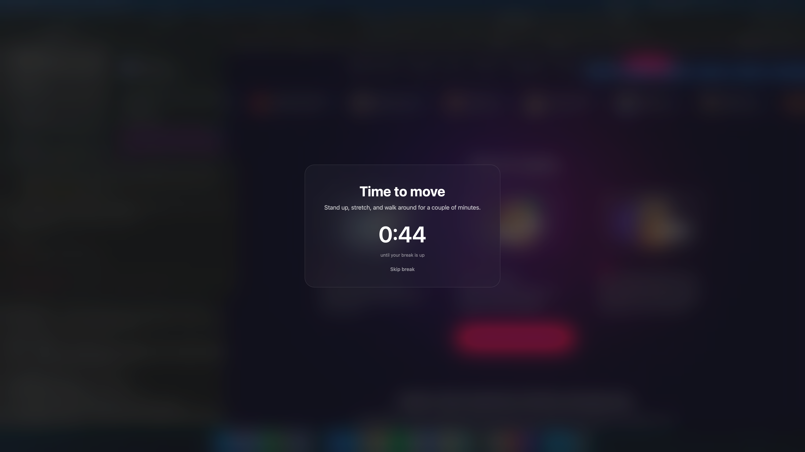

# move-reminder

 

A small macOS reminder to stand up and move about once an hour, timed from when you last woke your Mac rather than from the clock.

> Requirements: macOS, and the Xcode Command Line Tools (`xcode-select --install`) for the full-screen overlay. Without them you still get a simple dialog reminder.

Open your laptop at 9:17 and the first reminder arrives at 10:17, the next at 11:17. Close the lid and reopen it later, and the count starts over, so you always get a full hour of work before the next interruption. When the hour is up, the screen frosts over with a small card and a short countdown. Stay away until it clears, or press Skip break or Esc when you can't.



## What it does

It leaves you alone outside working hours. By default it only fires between 9am and 6pm, every day, and you can change both ends.

It stays small. One Bash script and a 95 KB Swift binary. No menu-bar icon, no Electron, nothing sitting on your CPU between reminders. A launchd agent keeps it running across sleep, wake, and login.

If Swift isn't installed, it skips the full-screen overlay and falls back to a plain notification dialog. You still get reminded.

## Install

```sh
curl -fsSL https://raw.githubusercontent.com/BigBalli/move-reminder/main/install.sh | bash
```

Or clone it and run the installer yourself:

```sh
git clone https://github.com/BigBalli/move-reminder.git
cd move-reminder && bash install.sh
```

You need macOS, plus the Xcode Command Line Tools (`xcode-select --install`) if you want the full-screen overlay. Without them you get the basic dialog instead. The overlay is compiled on your own machine during install, so there's no downloaded binary for Gatekeeper to flag.

## How it works

A launchd agent named `com.bigballi.move-reminder` runs the script every few minutes. Each run reads `sysctl kern.waketime`, the moment the system last woke, and uses it as the anchor. When that moment is newer than the one it saw last, the hour count resets. That single check is why reopening the lid restarts the clock.

The script then counts how many whole hours have passed since the anchor. Cross into a new one while you're inside the active window, and the overlay fires. Each hour fires once, so walking away for a while never leaves a stack of reminders waiting for you.

## Customize

Edit `~/Library/Application Support/move-reminder/move-reminder.sh`. Changes take effect on the next run, with no reload.

| Setting | Default | Meaning |
|---|---|---|
| `START_HOUR` | `9` | Active window start (24h, inclusive) |
| `END_HOUR` | `18` | Active window end (24h, exclusive) |
| `INTERVAL` | `3600` | Seconds between reminders |
| `BREAK_SECONDS` | `120` | Length of the break countdown |

The wording, colors, and type live in `src/MoveReminderOverlay.swift`. After editing it, recompile:

```sh
cd ~/Library/Application\ Support/move-reminder
swiftc -O MoveReminderOverlay.swift -o move-reminder-overlay -framework Cocoa
```

To check the timer more or less often, change `StartInterval` in `~/Library/LaunchAgents/com.bigballi.move-reminder.plist` and reload the agent.

## Commands

```sh
# See the reminder right now
bash ~/Library/Application\ Support/move-reminder/move-reminder.sh --test

# See just the overlay with a short countdown
~/Library/Application\ Support/move-reminder/move-reminder-overlay 10

# Stop it
launchctl bootout gui/$(id -u)/com.bigballi.move-reminder

# Start it again
launchctl bootstrap gui/$(id -u) ~/Library/LaunchAgents/com.bigballi.move-reminder.plist
```

## Uninstall

```sh
curl -fsSL https://raw.githubusercontent.com/BigBalli/move-reminder/main/uninstall.sh | bash
```

## License

MIT. See [LICENSE](LICENSE).
